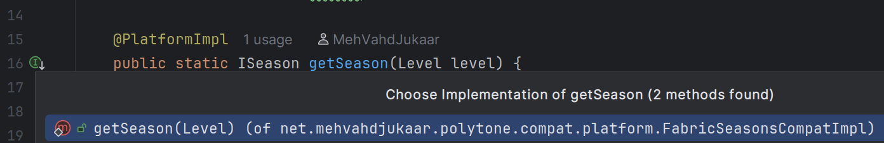
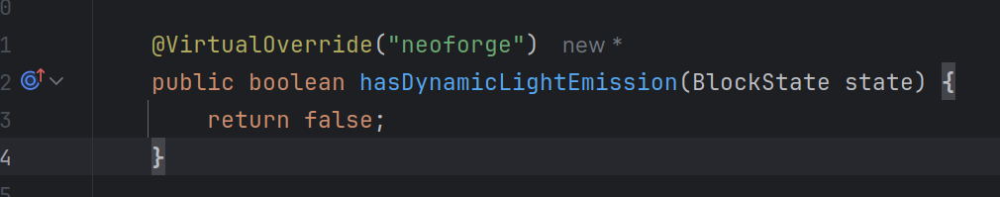

# Candlelight IDEA Plugin

An IntelliJ IDEA plugin to help with developing Minecraft mods in a cross-platform setup
Additional features available when using the [Candlelight](https://github.com/MehVahdJukaar/candle) Gradle plugin

## Disclaimer

This plugin is born out of a fork or [Architectury IDEA plugin](https://github.com/architectury/architectury-idea-plugin).
It's distributed under the same license.

## Features

Tested on Intellij 2025.3

### @PlatformImpl

-  navigation between @PlatformImpl methods and their platform implementations
-  Inspection warnings for missing platform implementations with quick fixes
-  Quick fix @PlatformImpl method with erroneous body

### @VirtualOverride

-  Code completion suggests platform‑specific overridable methods
-  Detects methods that override platform‑specific members (e.g., NeoForge‑only methods in Block) and treats them as valid overrides in common code.
-  Gutter icons navigate from a virtual override to its platform declaration
-  Implicit usage marks virtual overrides and their parameters as used
-  Works with @OptionalInterface annotation too
